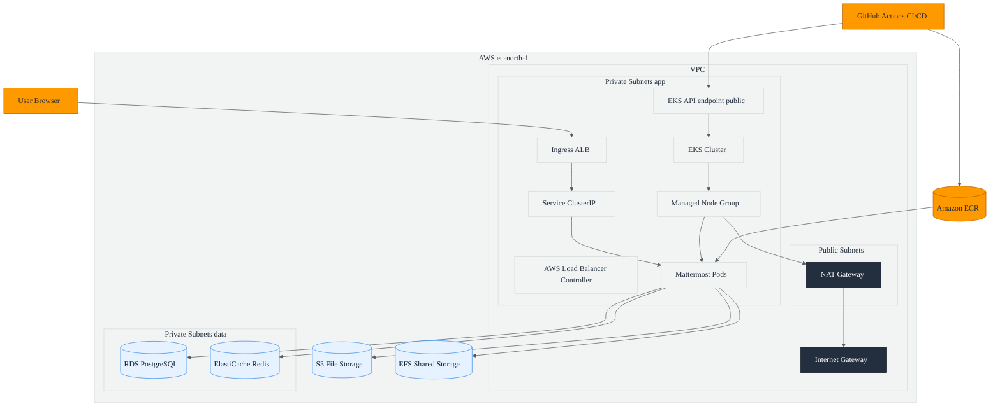

# Mattermost DevOps Architecture

## Notes

- Traffic is exposed via Ingress (AWS Load Balancer Controller -> ALB -> Service ClusterIP).
- App data path: `Mattermost -> RDS / ElastiCache / S3 / EFS`.
- CI/CD path: `GitHub Actions -> ECR -> EKS rollout`.
