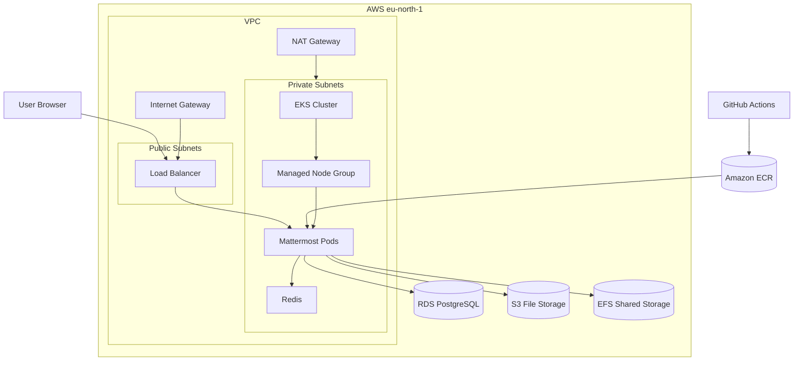

# Mattermost DevOps Architecture

```mermaid
flowchart TB
  user[User Browser]
  gha[GitHub Actions]
  ecr[(Amazon ECR)]

  subgraph aws[AWS eu-north-1]
    subgraph vpc[VPC]
      igw[Internet Gateway]
      nat[NAT Gateway]
      subgraph pub[Public Subnets]
        alb[Load Balancer]
      end
      subgraph priv[Private Subnets]
        eks[EKS Cluster]
        ng[Managed Node Group]
        mm[Mattermost Pods]
        redis[Redis]
      end
    end
    rds[(RDS PostgreSQL)]
    s3[(S3 File Storage)]
    efs[(EFS Shared Storage)]
  end

  user --> alb --> mm
  mm --> rds
  mm --> redis
  mm --> s3
  mm --> efs

  gha --> ecr
  ecr --> mm
  igw --> alb
  nat --> priv
  eks --> ng --> mm
```

## Notes

- Ingress/LB serves Mattermost traffic.
- App data path: `Mattermost -> RDS/Redis/S3/EFS`.
- CI/CD path: `GitHub Actions -> ECR -> EKS rollout`.
