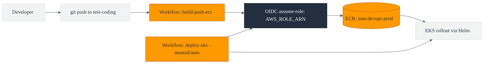

# CI/CD Pipeline (GitHub Actions)

```mermaid
%%{init: {'theme':'base','themeVariables':{
  'fontFamily':'Segoe UI, Arial, sans-serif',
  'primaryColor':'#FF9900',
  'primaryTextColor':'#232F3E',
  'primaryBorderColor':'#B85E00',
  'lineColor':'#545B64',
  'tertiaryColor':'#F2F3F3'
}}}%%

flowchart LR
  dev[Developer]
  push[git push to test-coding]
  build[Workflow: build-push-ecr]
  oidc[OIDC assume-role: AWS_ROLE_ARN]
  ecr[(ECR: mm-devops-prod)]
  deploy[Workflow: deploy-eks - manual/auto]
  eks[EKS rollout via Helm]

  dev --> push --> build
  build --> oidc --> ecr
  deploy --> oidc
  ecr --> eks
  deploy --> eks

  classDef awsfill fill:#FF9900,stroke:#B85E00,color:#232F3E;
  classDef dark fill:#232F3E,stroke:#111820,color:#FFFFFF;
  classDef light fill:#F2F3F3,stroke:#D5DBDB,color:#232F3E;

  class dev light;
  class push light;
  class build,deploy awsfill;
  class oidc dark;
  class ecr awsfill;
  class eks light;
```

## What To Screenshot

- GitHub Actions run page:
  - `build-push-ecr` successful run (steps + green check).
  - `deploy-eks` run (when EKS exists).
